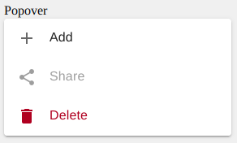
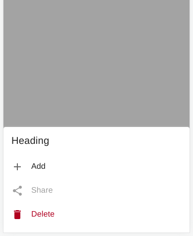

# `<dw-menu>` [](https://www.npmjs.com/package/@dreamworld/dw-menu)

- Menus displays a list of choices on temporary surfaces like Popover dialog in Desktop and Tablet.
- On mobile, the Menu is displayed on the bottom sheet. When menu items are overflowed Menu items are shown as Fit Dialog.
- Menu is composed of various menu items.
- It may have Divider to group menu items.

> **Note:** `dw-menu` extends [`dw-composite-dialog`](https://github.com/DreamworldSolutions/dw-dialog/blob/master/dw-composite-dialog.js) to render a temporary surface.
> So, `dw-menu` has all the behaviors of `dw-composite-dialog`.

## Installation

```sh
npm install @dreamworld/dw-menu
```

## Example usage

### Default



```html
<dw-menu .actions="${actions}" .disabledActions="${disabledActions}" .hiddenActions="${hiddenActions}" @action="${handler}"></dw-menu>
```

### Mobile Mode



```html
<dw-menu
  mobile-mode
  .heading="${'Heading'}"
  .actions="${actions}"
  .disabledActions="${disabledActions}"
  .hiddenActions="${hiddenActions}"
  @action="${handler}"
></dw-menu>
```

## API

### Properties/Attributes

| Name                | Type                  | Default     | Description                                                                                                                                                                                                                                                                            |
| ------------------- | --------------------- | ----------- | -------------------------------------------------------------------------------------------------------------------------------------------------------------------------------------------------------------------------------------------------------------------------------------- |
| `opened`            | `boolean`             | `false`     | Set to `true` to show it opened.                                                                                                                                                                                                                                                       |
| `actions`           | `Action[]`            | `undefined` | Represent total available actions/sub actions in the menu.                                                                                                                                                                                                                             |
| `disabledActions`   | `Object`              | `undefined` | Specifies actions that are disabled. key = action name, value = Tooltip message to be shown for that action.                                                                                                                                                                           |
| `hiddenActions`     | `String[]`            | `[]`        | Actions specified here aren't visible (rendered) in the menu.                                                                                                                                                                                                                          |
| `mobileMode`        | `boolean`             | `false`     | Displayed on the bottom sheet in most cases. When menu items are overflowed Menu items are shown as Fit dialog.                                                                                                                                                                        |
| `anchor`            | `HTMLElement`\|`null` | `null`      | Element to which this menu should be anchored. Applicable only when `mobileMode=false`.                                                                                                                                                                                                |
| `keepAnchorVisible` | `boolean`             | `false`     | By default, When the menu is opened, it covers (hides) the anchor elements. Set it to `true`, to make it visible. Applicable only when `mobileMode=false`.                                                                                                                             |
| `placement`         | `String`              | `top-start` | Possible values: `top-start`, `top-end`, `bottom-start` and `bottom-end`. Applicable only when `mobileMode=false`.                                                                                                                                                                     |
| `heading`           | `String`              | `null`      | Set it if you would like to show a heading on the menu. By default no heading.                                                                                                                                                                                                         |
| `showClose`         | `boolean`             | `false`     | Shows an icon-button with a close icon, in the `top-right` corner. As the menu is closed when the user clicks away, this isn't needed in most cases. Though, if you would like to show it sometimes, e.g. when `mobileMode=true`.                                                      |
| `disableAutoClose`  | `Boolean`             | `false`     | To prevent the `close` event from triggering on menu item clicks, it has been disabled. <br> The `close` event will now be dispatched exclusively when the close icon is clicked, when a user clicks outside the menu, or when the menu is closed through any other appropriate means. |

### Action

#### Object

| Key                   | Type      | Description                                                                                                                              |
| --------------------- | --------- | ---------------------------------------------------------------------------------------------------------------------------------------- |
| `name`                | `String`  | name of the action. It's available in `action` event detail.                                                                             |
| `label`               | `String`  | label of the action                                                                                                                      |
| `icon`                | `String`  | Name of the icon to show as a leading icon                                                                                               |
| `danger`              | `Boolean` | Shows action in danger mode. e.g. For delete action, you might need it.                                                                  |
| `type`                | `String`  | Type of the action. Applicable only when action has `subActions`. possible values: `collapsible`, `submenu`. default value: `collapsible` |
| `subActions`          | `Array[]` | Sub Actions of the current action. Used when a group of actions comes under any same parent item.                                        |
| `divider`             | `Boolean` | Set border bottom of the list item.                                                                                                      |
| `hasLeadingIconSpace` | `Boolean` | Leave space for the icon (40px) in the list item. only applicable when an `icon` value has not been set.                                 |

#### Example

##### Basic

```object
{
  name: "ADD",
  label: "Add",
  icon: "add",
}
```

##### With Sub Actions

```object
{
  name: "ADD",
  label: "Add",
  icon: "add",
  subActions: [
    {name: "TOP", label: "Move to Top", icon: 'arrow_up'},
    {name: "BOTTOM", label: "Move to Bottom", icon: 'arrow_down'}
  ]
}
```

##### Danger action

```object
{
  name: "DELETE",
  label: "Delete",
  icon: "delete",
  danger: true
}
```

#### Sub Actions Without Leading Icon

[{
name: "ADD",
label: "Add",
icon: "add",
subActions: [
{name: "TOP", label: "Move to Top", hasLeadingIconSpace: true},
{name: "BOTTOM", label: "Move to Bottom", hasLeadingIconSpace: true}
]
},
{
name: "ADD",
label: "Add",
hasLeadingIconSpace: true
subActions: [
{name: "TOP", label: "Move to Top", hasLeadingIconSpace: true},
{name: "BOTTOM", label: "Move to Bottom", hasLeadingIconSpace: true}
]
}]

### disabledActions

- Specifies actions that are disabled.
- key = action name
- value = text (Tooltip message to be shown for that action) **OR** `true` (disable an item but don't want to show any tip).
- **NOTE:** These actions must be declared in the `actions` property.

```object
{
  SHARE: "Share is disabled"
  DELETE: true
}
```

### Events

| Event Name | Target    | Detail   | Description                                                                                                                                         |
| ---------- | --------- | -------- | --------------------------------------------------------------------------------------------------------------------------------------------------- |
| `action`   | `dw-menu` | `{name}` | Fired when a menu item is selected by the User (keyboard or mouse interaction). `name` represents the action represented by the selected menu item. |

### CSS Custom Properties

| Name                                | Default             | Description                             |
| ----------------------------------- | ------------------- | --------------------------------------- |
| `--dw-menu-header-padding`          | `0 0 0 16px`        | Padding of header area.                 |
| `--dw-menu-content-padding`         | `0`                 | Padding of content area.                |
| `--dw-menu-danger-action-color`     | `#B00020`           | Danger action color                     |
| `--dw-menu-list-item-divider-color` | rgba(0, 0, 0, 0.12) | Divider color for collapsible list item |

# Design Decisions

- No property to configure animation. Animation style would be as suggested by the material standards.

# Future Enhancements

- Keyboard Navigation
- Custom Footer (via `slot` or template override)
- Group Items (divider)
- Tooltip for the Disabled Items.
- Expandable Menu Items
- `href` (Link) support for an Item. It may be set to open in a new window only. In that case, it’s trailing icon is also auto-chosen.
- Sub-Menu: Opens another menu on the side of the current menu. (Long-term deferred)
